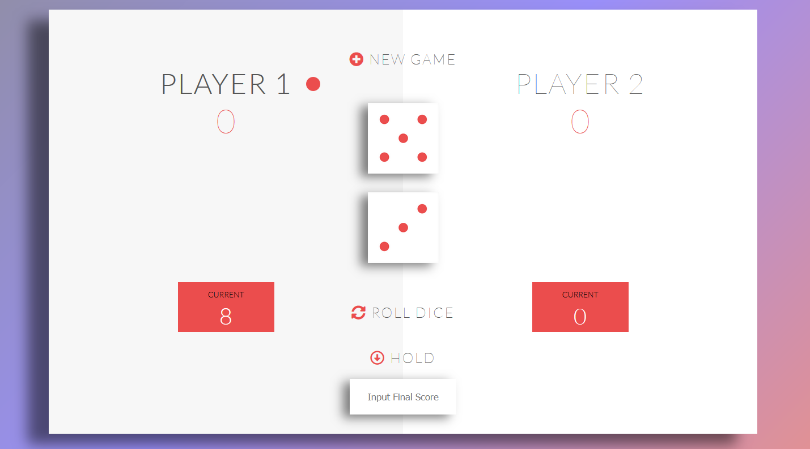

# Pig-Game

Small & Interesting Pig Game using JS DOM Manipulation

# Rules of the Game play
- The game has 2 players, playing in rounds
- In each turn, a player rolls a dice as many times as he wishes. Each result get added to his Round score
- But, if the player rolls a '1', all his round score gets lost. After that, it's the next players's turn.
- The player can choose to 'Hold', which means that his ROUND score gets added to his Total score. 
  After that, it's the next player's turn
- The first player to reach 100 points on Total score wins the game

## V 2.0
- Player looses all his score if he scores 6 twice in a row
- New Input field to set the winning score
- Add second dice (If only one dice is 1 then you loose all score)
